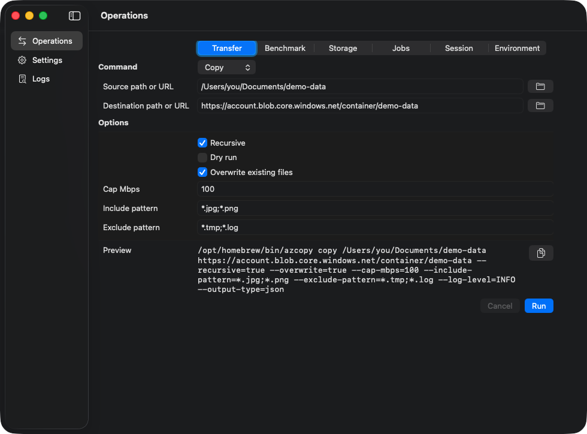

# azcopy-mac-ui

Native macOS GUI for [AzCopy](https://github.com/Azure/azure-storage-azcopy), written in Swift 6.



## Status

Current version: `0.1.1`.

This app does not bundle AzCopy. Install AzCopy with Homebrew:

```sh
brew install azcopy
```

The app resolves `/opt/homebrew/bin/azcopy` first on Apple Silicon and treats Homebrew `azcopy` as a distribution dependency.

## Requirements

- macOS 14 Sonoma or newer
- Apple Silicon / arm64
- Xcode 26 or newer with Swift 6
- Homebrew `azcopy`

## Installation

Install from the Homebrew tap:

```sh
brew tap rioriost/cask
brew install --cask azcopy-mac-ui
```

The cask depends on the Homebrew `azcopy` formula and installs `AzCopy Mac UI.app`.

## Development

```sh
swift test --enable-code-coverage
Scripts/check-coverage.sh
Scripts/security-review.sh
xcodebuild -project AzCopyMacUI.xcodeproj -scheme AzCopyMacUI -destination 'platform=macOS,arch=arm64' build
```

SwiftPM is used for the testable `AzCopyMacUICore` library. The macOS app is built through the Xcode project so the generated `.app` bundle matches the signing, hardened runtime, notarization, and Homebrew cask requirements.

## Distribution

Release builds are designed for a custom Homebrew tap cask. The release artifact is an arm64 `.app` zip produced from an Xcode archive, signed with Developer ID, notarized, stapled, Gatekeeper-assessed, and checksumed before cask publication.

Local release builds use signing identities and a notary profile stored in your macOS Keychain. Set these values before running the release script:

```sh
export DEVELOPER_ID_APPLICATION="Developer ID Application: Example, Inc. (TEAMID)"
export APPLE_TEAM_ID="TEAMID"
export NOTARY_PROFILE="profile-name"
```

If `APPLE_TEAM_ID` is omitted, the script derives it from the team ID in `DEVELOPER_ID_APPLICATION`.

If you need to create a new notary profile, use an app-specific password:

```sh
xcrun notarytool store-credentials "$NOTARY_PROFILE" \
  --apple-id "apple-id@example.com" \
  --team-id "TEAMID" \
  --password "app-specific-password"
```

Build the release artifact:

```sh
Scripts/package-release.sh
```

After the script finishes, publish `release/azcopy-mac-ui-<version>-macos-arm64.zip` and update the cask `sha256` with the value printed by the script.

## License

MIT.
