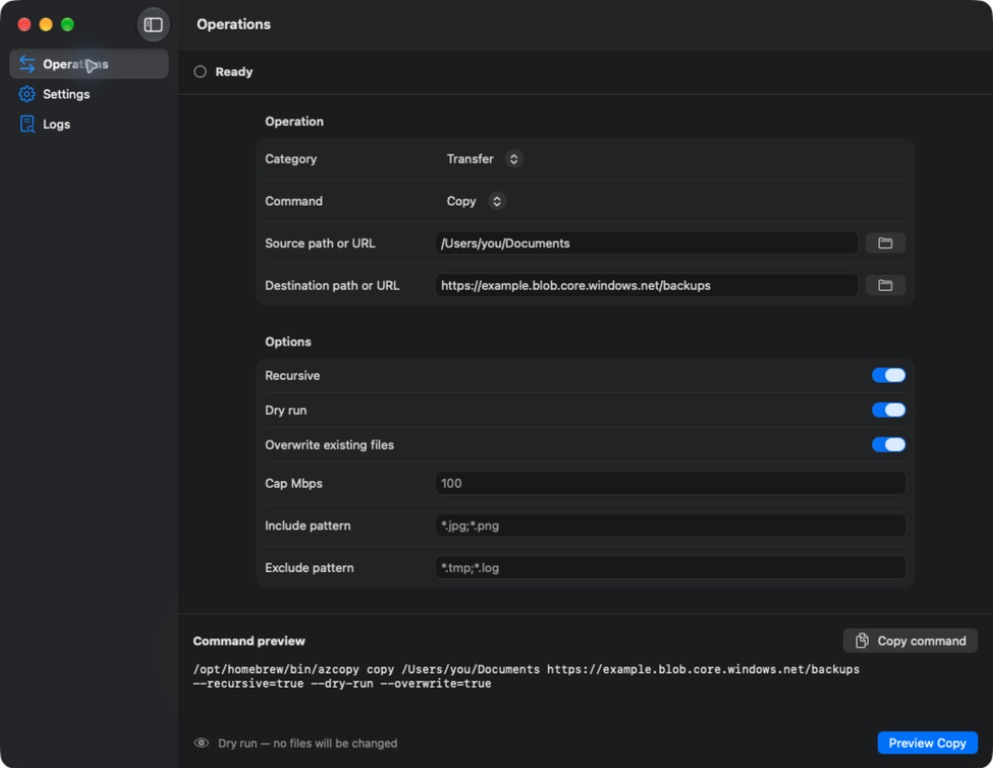

# azcopy-mac-ui

Native macOS GUI for [AzCopy](https://github.com/Azure/azure-storage-azcopy), written in Swift 6.



## Status

Current development version: `0.2.2`.

This app does not bundle AzCopy. Install AzCopy with Homebrew:

```sh
brew install azcopy
```

The app resolves `/opt/homebrew/bin/azcopy` first on Apple Silicon and treats Homebrew `azcopy` as a distribution dependency.

## Requirements

- macOS 14 Sonoma or newer
- Apple Silicon / arm64
- Xcode 26 or newer with Swift 6
- Homebrew `azcopy`

## Tested AzCopy version

**AzCopy 10.32.8** — verified on 2026-09-21 with macOS 27.0 (26A428), Apple Silicon,
and Xcode 27.0. This was the [latest stable upstream release](https://github.com/Azure/azure-storage-azcopy/releases/tag/v10.32.8)
at the time of verification.

- All 15 GUI operation commands and their managed flags, plus eight sign-in argument variants, were accepted by the installed CLI.
- Actual SAS Blob upload/download, content equality, recursive transfer/filtering, listing, sync, metadata, job inspection/removal, and copy/sync/remove dry runs passed against local Azurite 3.37.0.
- Real Azure login/authorization, Azure Files, ADLS, benchmarks, job resume, and remote resource creation remain unverified. Flag recognition alone does not establish authentication or service behavior.

See [compatibility test instructions](Scripts/README.md#installed-azcopy-compatibility)
for reproducing the checks with another AzCopy version, and the
[verification record](docs/verification-2026-09-21.md) for scope and GUI checks.

## Installation

Install from the Homebrew tap:

```sh
brew tap rioriost/cask
brew install --cask azcopy-mac-ui
```

The cask depends on the Homebrew `azcopy` formula and installs `AzCopy Mac UI.app`.

## Development

```sh
Scripts/release-preflight.sh
xcodebuild -project AzCopyMacUI.xcodeproj -scheme AzCopyMacUI -destination 'platform=macOS,arch=arm64' build
```

SwiftPM tests both `AzCopyMacUICore` and the app model. The macOS app is built through the Xcode project so the generated `.app` bundle matches the signing, hardened runtime, notarization, and Homebrew cask requirements.
The preflight runs the complete Swift and script regressions, core line-coverage gate,
security pattern checks, and version consistency checks. See [Scripts/README.md](Scripts/README.md)
for targeted commands and supported coverage layouts.

## Safe operation and authentication

Open Settings from the sidebar or with **⌘,**. Use **Sign In** for Microsoft Entra user login; **Load tenants** explicitly reads the available tenants from Azure CLI. Authentication instructions and transfer output appear while the command is running. **Cancel** stops the active child process; quitting during a command asks to cancel it before exiting.

The operation form adapts to the window width, with the command preview and primary action kept visible below the scrollable options. Run the selected operation from the **Operation** menu or with **⌘Return**. Dry runs use a **Preview** action label.

Recursive and dry-run settings are explicit. Remove, sync with destination deletion, and job deletion require confirmation of the exact command. Editing the form does not change an already running or confirmed command.

Additional flags support single/double quoted values and backslash escapes, without shell evaluation. They cannot override options managed by the form and are not saved between launches. URLs are saved without query strings, fragments, or user credentials; re-enter SAS credentials after restarting. Version 0.2.1 removes previously saved URL credentials and additional flags. Logs and previews redact credentials, and in-memory output is bounded.

Managed identity Object ID authentication is no longer supported by current AzCopy versions. Use a client ID or resource ID instead; existing Object IDs are not automatically reinterpreted.

## Distribution

Release builds are designed for a custom Homebrew tap cask. The release artifact is an arm64 `.app` zip produced from an Xcode archive, signed with Developer ID, notarized, stapled, Gatekeeper-assessed, and checksumed before cask publication.

Local release builds use signing identities and a notary profile stored in your macOS Keychain.
Bind this checkout to an **existing** profile once:

```sh
python3 Scripts/release-config.py configure --notary-profile "existing-profile-name"
```

A unique valid Developer ID Application identity and its team are selected automatically.
Use `--signing-identity "Developer ID Application: Example, Inc. (TEAMID)"` if several
identities are available. For credentials saved in a custom Keychain file, also pass
`--notary-keychain "/path/to/release.keychain-db"`.

Only nonsecret references are saved in this checkout's local `.git/config`; passwords
and private keys remain in Keychain. Subsequent releases require no environment exports.
`DEVELOPER_ID_APPLICATION`, `APPLE_TEAM_ID`, `NOTARY_PROFILE`, and `NOTARY_KEYCHAIN`
remain available as explicit overrides for automation.

Inspect or validate the existing binding without building:

```sh
python3 Scripts/release-config.py show
python3 Scripts/release-config.py check
```

An unset profile reference does **not** mean that credentials are missing from Keychain.
`notarytool` has no profile-list command, and protected/iCloud profiles may not be visible
to `security dump-keychain`. Use the original `store-credentials` profile name; do not
recreate credentials merely because an environment variable is unset.
See [Scripts/README.md](Scripts/README.md) for configuration and recovery details.

Build the release artifact:

```sh
Scripts/package-release.sh
```

Packaging reruns all preflight gates before accessing credentials or creating artifacts.
Credentials are validated before creating a release stage. An existing
`release/<version>/` is refused by default; `Scripts/package-release.sh --retry`
preserves it in a uniquely named backup before starting a new attempt.
After the script finishes, publish `release/<version>/azcopy-mac-ui-<version>-macos-arm64.zip`
and its `.sha256` file, then update the cask version and checksum.

## License

MIT.
