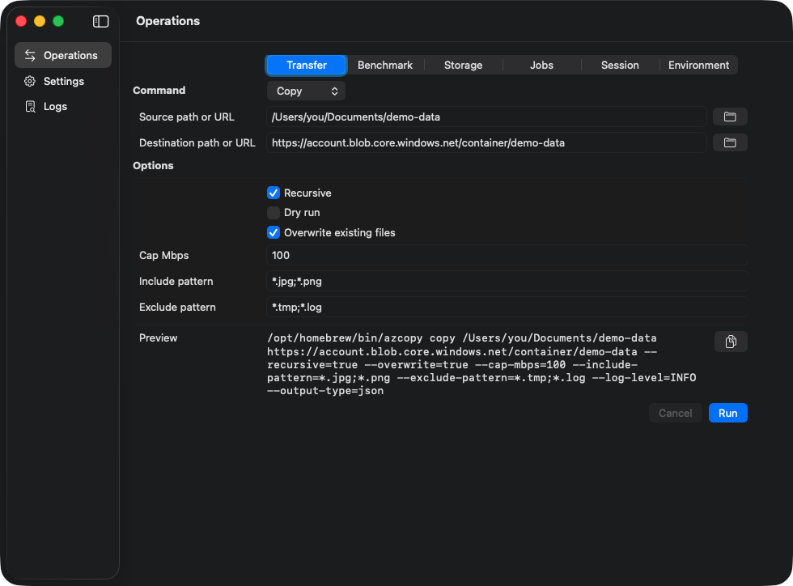

# azcopy-mac-ui

Native macOS GUI for [AzCopy](https://github.com/Azure/azure-storage-azcopy), written in Swift 6.



## Status

Current development version: `0.2.1`.

This app does not bundle AzCopy. Install AzCopy with Homebrew:

```sh
brew install azcopy
```

The app resolves `/opt/homebrew/bin/azcopy` first on Apple Silicon and treats Homebrew `azcopy` as a distribution dependency.

## Requirements

- macOS 14 Sonoma or newer
- Apple Silicon / arm64
- Xcode 26 or newer with Swift 6
- Homebrew `azcopy`

## Installation

Install from the Homebrew tap:

```sh
brew tap rioriost/cask
brew install --cask azcopy-mac-ui
```

The cask depends on the Homebrew `azcopy` formula and installs `AzCopy Mac UI.app`.

## Development

```sh
Scripts/release-preflight.sh
xcodebuild -project AzCopyMacUI.xcodeproj -scheme AzCopyMacUI -destination 'platform=macOS,arch=arm64' build
```

SwiftPM tests both `AzCopyMacUICore` and the app model. The macOS app is built through the Xcode project so the generated `.app` bundle matches the signing, hardened runtime, notarization, and Homebrew cask requirements.
The preflight runs the complete Swift and script regressions, core line-coverage gate,
security pattern checks, and version consistency checks. See [Scripts/README.md](Scripts/README.md)
for targeted commands and supported coverage layouts.

## Safe operation and authentication

Use **Sign In** in Settings for Microsoft Entra user login. Authentication instructions and transfer output appear while the command is running. **Cancel** stops the active child process; quitting during a command asks to cancel it before exiting.

Recursive and dry-run settings are explicit. Remove, sync with destination deletion, and job deletion require confirmation of the exact command. Editing the form does not change an already running or confirmed command.

Additional flags support single/double quoted values and backslash escapes, without shell evaluation. They cannot override options managed by the form and are not saved between launches. URLs are saved without query strings, fragments, or user credentials; re-enter SAS credentials after restarting. Version 0.2.1 removes previously saved URL credentials and additional flags. Logs and previews redact credentials, and in-memory output is bounded.

Managed identity Object ID authentication is no longer supported by current AzCopy versions. Use a client ID or resource ID instead; existing Object IDs are not automatically reinterpreted.

## Distribution

Release builds are designed for a custom Homebrew tap cask. The release artifact is an arm64 `.app` zip produced from an Xcode archive, signed with Developer ID, notarized, stapled, Gatekeeper-assessed, and checksumed before cask publication.

Local release builds use signing identities and a notary profile stored in your macOS Keychain. Set these values before running the release script:

```sh
export DEVELOPER_ID_APPLICATION="Developer ID Application: Example, Inc. (TEAMID)"
export APPLE_TEAM_ID="TEAMID"
export NOTARY_PROFILE="profile-name"
```

If `APPLE_TEAM_ID` is omitted, the script derives it from the team ID in `DEVELOPER_ID_APPLICATION`.

If you need to create a new notary profile, use an app-specific password:

```sh
xcrun notarytool store-credentials "$NOTARY_PROFILE" \
  --apple-id "apple-id@example.com" \
  --team-id "TEAMID" \
  --password "app-specific-password"
```

Build the release artifact:

```sh
Scripts/package-release.sh
```

Packaging reruns all preflight gates before accessing credentials or creating artifacts.
It refuses an existing `release/<version>/` directory rather than deleting earlier builds.
After the script finishes, publish `release/<version>/azcopy-mac-ui-<version>-macos-arm64.zip`
and its `.sha256` file, then update the cask version and checksum.

## License

MIT.
